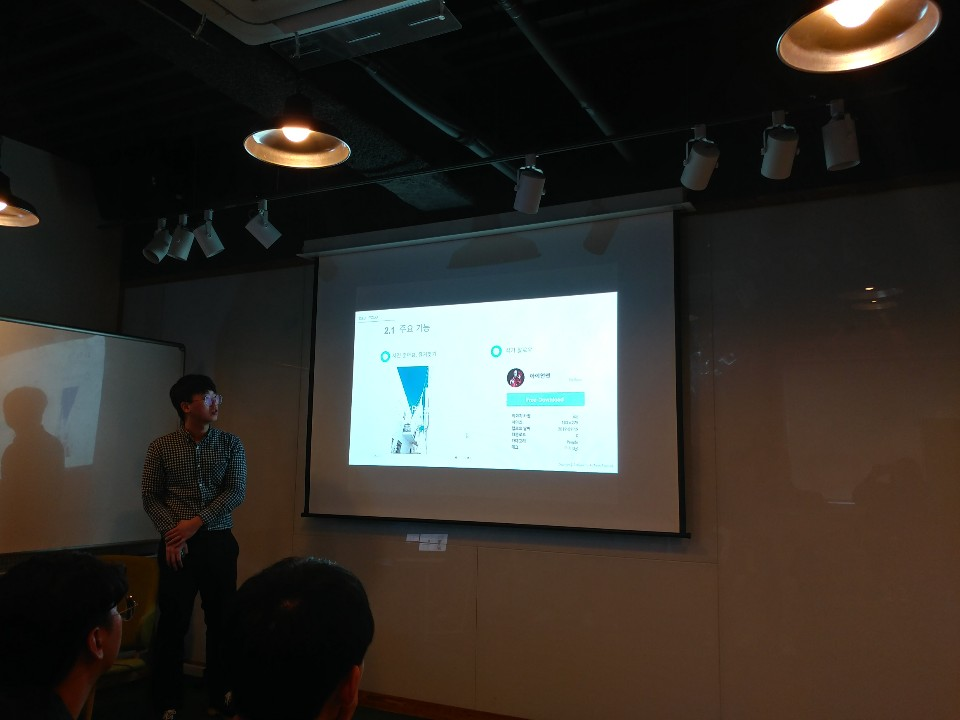
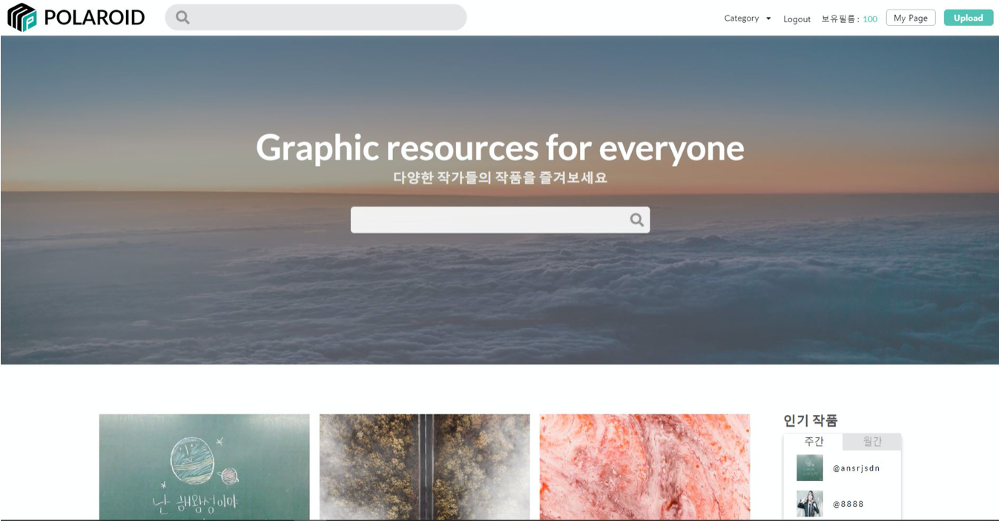
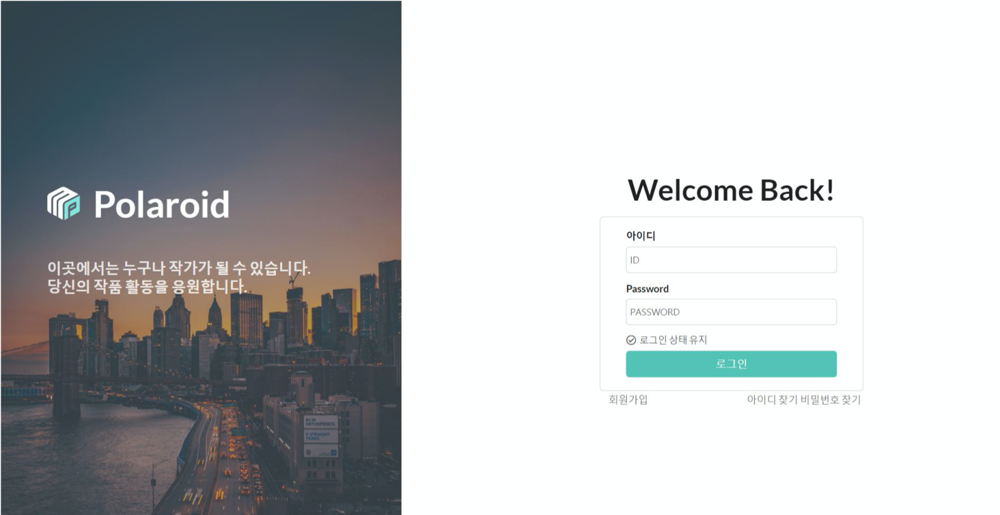
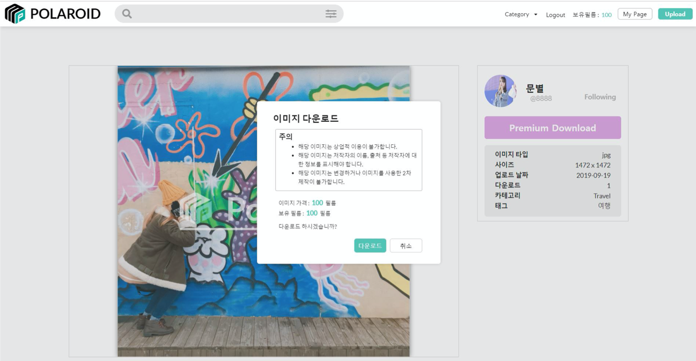
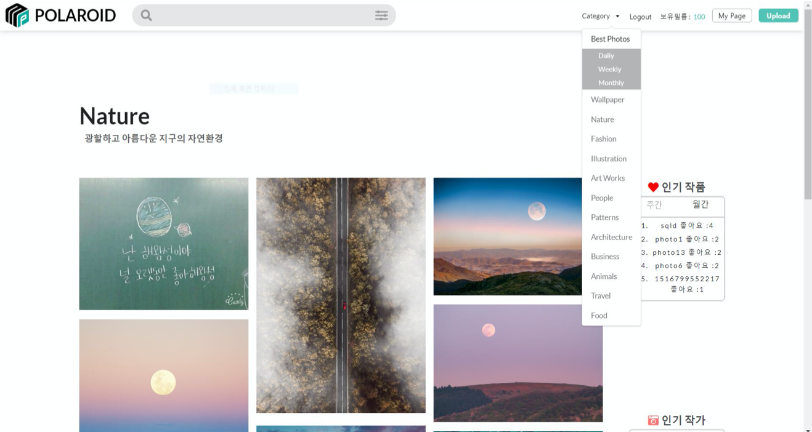

# DND_Project
부산 IT연합동아리 DND 3팀 POLO를 하고 느낀점

DND 사이트 : dnd.ac

DND 프로젝트는 2019년 7월 13일부터 9월 22일까지 거의 12주 동안 진행한 프로젝트이다.
페이스북에서 부산지역 IT연합동아리를 모집한다는 글을 보고 학교 과동아리인 DATAPIA 동아리원 5명이서 같이
신청을 하게 되었고 모두 다 붙어서 같이 프로젝트를 진행하게 되었다.

제대로 된 프로젝트를 해본 경험이 팀원 모두 없어서 불안하긴 했지만 현직자 분들의 조언도 들을 수 있고 
언제까지나 안 해볼순 없으니 한번 해보자!라는 생각으로 열심히 하게 되었다.
개발은 내가 조금이라도 해본 react를 하는게 팀원들에게 조금이라도 도움이 될거 같아 프론트쪽은 react로 진행을
하게 되었고. 백엔드쪽은 내가 거의 전적으로 맡아 nodejs의 express를 사용하여 개발을 하게 되었다.
우리 프로젝트의 주제는 사진 공유 및 판매 사이트를 만들어 보는 것이었다.

중간 결과까지는 아직 불안하고 못 할거 같기도 하고...별 생각이 다들었지만 최종발표 때까지 하면서 팀원들의
실력도 많이 는거 같고 나의 실력도 훨씬 향상 됐음을 느꼈다. 이번 프로젝트를 통해 다른 프로젝트도 더 잘 할
수 있을 것 같다는 자신감이 생겼고 앞으로도 계속 프로젝트를 해나갈거 같다. DND 2기나 다른 해커톤에 나가고
싶어졌다.

### 발표하는 사진

### 최종 결과물 사진

나는 원래 react를 조금 배운거 말고는 웹에 대해 잘 아는건 아니었다. react로도 프로젝트를 안 해봤었기 때문에
어떻게 써야 할지 사실 막막했다. 하지만 이번 프로젝트를 하면서 state, props에 관한 많은 이해와 lifecylce에
대해 많은 지식을 쌓을 수 있었던 것 같다. 그리고 react 프론트쪽과 express 백엔드 쪽의 연결도 어떻게 해야할지
몰라서 구글과 유튜브에서 찾아보면서 연결하는 법을 배웠고, 내가 서버쪽도 맡았기 때문에 배포를 해야 해서 
Heroku에도 배포를 해보고 aws ec2에 배포도 해보면서 서버쪽에 대한 이해도 조금 는 것 같다. 그리고 배포를 하
고나서 보이는 aws의 도메인이 마음에 들지 않아서 freenom에서 무료 도메인도 처음으로 받아봤고 poloapp.tk로 
받아서 aws ec2를 로드밸런싱을 하고 route 53을 이용해 도메인을 설정해보는 것도 많은 도움이 된 것 같다. 
aws rds를 사용해보는 것도 좋았는데 heidi sql을 사용해서 접속하고 express에서도 접속 할 수 있게 만들고 
sequelize를 통해 접근하고 조작해보는 것도 너무 좋았다. 그리고 실수로 rds를 사용하지 않는데도 계속 켜놔서
프리티어의 시간이 지나버려서 과금을 하게 되는 ... 실수도 해보아서 aws 결제 내역을 자주 보게 되는... 그런것에
대해 더 관심이 가지게 되는 점이 좋았던 것 같다. 확실하게 경제 관념이 생겼다고 해야하나... 그렇다.

하다보니 react의 상위 컴포넌트의 state 값을 하위 컴포넌트로 내려주고 내려주고... 하다보니 너무 어렵고
복잡해지는 감을 느꼈다. 그래서 redux 도는 mobx 의 필요성을 느꼈고 공부해서 다음에는 redux를 활용 해서 
프로젝트를 하고 싶다는 생각이 들었다.
그리고 현재 프로젝트는 class형 컴포넌트를 사용하여 legacy한 프로젝트를 진행하였다. 하지만 최적화나 여러 요
즘트렌드를 보았을 때 함수형 컴포넌트로 state 값과 lifecylce을 사용할 수 있는 react hooks를 배워보고 싶어졌다.\
다음 프로젝트 때는 react hooks도 배워서 더 멋지고 최적화된 사이트를 만들어 볼 생각이다.
그리고 이번에는 css를 그냥 css만 사용해서 만들었는데 다음에는 css 전처리기인 sass나 라이브러리인 styled_components를
활용해서 만들어보자고 회의하였다.

DND를 통해서 git 사용법, 협업, 여러가지 기술에 대해 공부해볼 수 있어서 좋았고 현직자분들의 조언을 들어 볼
수있어 너무 좋았던거 같다. DND 2기까지 하여야 수료증을 준다고 하니 다음에는 더 공부해서 더 완벽한 프로젝트를
진행하여야겠다고 생각했다. 끝까지 열심히 해준 팀원들과 많은 조언을 해준 DND 멘토님들께 감사드린다.

